# Protocolo de Comunicação v1

Este documento define o contrato desejado entre cliente e servidor para o chat em rede local. Ele descreve como o cliente deve se identificar, como diferenciar mensagens diretas, mensagens de grupo, comandos e eventos do servidor, e quais respostas devem ser esperadas.

O código atual ainda usa `ChatMessage` e respostas em `String`. Este protocolo documenta o alvo de implementação para evoluir essa comunicação sem misturar texto de chat com controle do sistema.

## Objetivos

- Usar sockets TCP com `ObjectInputStream` e `ObjectOutputStream`.
- Trafegar envelopes Java serializáveis, não strings soltas.
- Exigir `LOGIN` antes de qualquer outra ação.
- Separar claramente requisições do cliente, respostas do servidor e eventos enviados pelo servidor.
- Suportar mensagem direta 1:1, chamada neste documento de e2e.
- Suportar ciclo de vida básico de grupos.
- Manter histórico em memória enquanto o servidor estiver em execução.

## Conceitos

| Conceito | Descrição |
| --- | --- |
| Sessão | Associação entre um socket conectado e um usuário autenticado via `LOGIN`. |
| Usuário | Participante identificado por `username`, `displayName` e um `memberId` interno. |
| Grupo | Sala identificada por `groupCode`, com nome público, dono e membros. |
| Mensagem direta | Mensagem privada de um usuário para outro usuário online. |
| Mensagem de grupo | Mensagem enviada por um membro para todos os membros online de um grupo. |
| Comando | Ação tipada enviada pelo cliente, como `CREATE_GROUP` ou `SEND_DIRECT`. |
| Evento | Notificação assíncrona enviada pelo servidor, como `DIRECT_MESSAGE` ou `USER_ONLINE`. |

Neste protocolo, "e2e" significa mensagem direta 1:1. Não significa criptografia ponta a ponta.

## Transporte

A comunicação usa uma única conexão TCP por cliente.

1. O cliente abre o socket.
2. O cliente cria `ObjectOutputStream`, chama `flush()` e cria `ObjectInputStream`.
3. O servidor cria seus streams na ordem compatível.
4. O primeiro envelope enviado pelo cliente deve ser `LOGIN`.
5. Depois do login, a conexão vira duplex:
   - o cliente envia `ClientRequest`;
   - o servidor responde com `ServerResponse`;
   - o servidor também pode enviar `ServerEvent` a qualquer momento.

O cliente precisa manter uma rotina de leitura contínua. Essa rotina deve distinguir `ServerResponse` de `ServerEvent`. Respostas são correlacionadas por `requestId`; eventos não respondem diretamente a uma requisição.

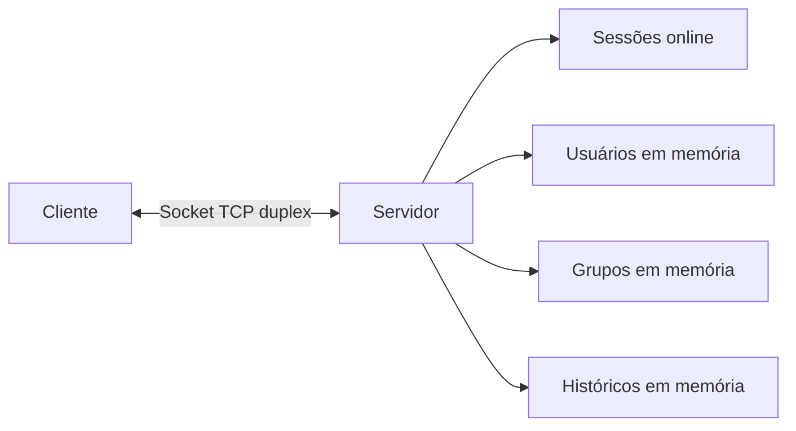

## Envelopes

### ClientRequest

Envelope enviado pelo cliente para solicitar uma ação.

| Campo | Tipo | Obrigatório | Descrição |
| --- | --- | --- | --- |
| `protocolVersion` | `String` | Sim | Versão do protocolo. Nesta versão: `"1.0"`. |
| `requestId` | `UUID` | Sim | Identificador único da requisição. |
| `action` | `String` | Sim | Ação solicitada. |
| `sentAt` | `Instant` | Sim | Momento de envio pelo cliente. |
| `payload` | `Map<String, Serializable>` | Sim | Dados específicos da ação. Use mapa vazio quando não houver dados. |

Exemplo conceitual:

```text
ClientRequest {
  protocolVersion = "1.0",
  requestId = "1ccae62c-14df-4c2e-9ef3-31d6b2f56065",
  action = "SEND_DIRECT",
  sentAt = "2026-06-28T12:00:00Z",
  payload = {
    targetUsername = "maria",
    text = "Oi!"
  }
}
```

### ServerResponse

Envelope enviado pelo servidor como resposta a um `ClientRequest`.

| Campo | Tipo | Obrigatório | Descrição |
| --- | --- | --- | --- |
| `protocolVersion` | `String` | Sim | Versão do protocolo. |
| `requestId` | `UUID` | Sim | Mesmo `requestId` da requisição respondida. |
| `status` | `String` | Sim | `OK` ou `ERROR`. |
| `code` | `String` | Sim | Código de sucesso ou erro. |
| `message` | `String` | Sim | Mensagem humana curta. |
| `payload` | `Map<String, Serializable>` | Sim | Dados retornados. Use mapa vazio quando não houver dados. |
| `respondedAt` | `Instant` | Sim | Momento da resposta pelo servidor. |

Exemplo de sucesso:

```text
ServerResponse {
  protocolVersion = "1.0",
  requestId = "1ccae62c-14df-4c2e-9ef3-31d6b2f56065",
  status = "OK",
  code = "MESSAGE_ACCEPTED",
  message = "Mensagem aceita pelo servidor.",
  payload = {
    messageId = "2dca2764-e96b-4469-8355-0fd7db9267c5",
    deliveredToOnline = true
  },
  respondedAt = "2026-06-28T12:00:01Z"
}
```

Exemplo de erro:

```text
ServerResponse {
  protocolVersion = "1.0",
  requestId = "1ccae62c-14df-4c2e-9ef3-31d6b2f56065",
  status = "ERROR",
  code = "USER_OFFLINE",
  message = "O usuário de destino não está online.",
  payload = {},
  respondedAt = "2026-06-28T12:00:01Z"
}
```

### ServerEvent

Envelope enviado pelo servidor sem ter sido solicitado diretamente naquele momento.

| Campo | Tipo | Obrigatório | Descrição |
| --- | --- | --- | --- |
| `protocolVersion` | `String` | Sim | Versão do protocolo. |
| `eventId` | `UUID` | Sim | Identificador único do evento. |
| `eventType` | `String` | Sim | Tipo do evento. |
| `emittedAt` | `Instant` | Sim | Momento de emissão pelo servidor. |
| `payload` | `Map<String, Serializable>` | Sim | Dados específicos do evento. |

Exemplo:

```text
ServerEvent {
  protocolVersion = "1.0",
  eventId = "c9ab8f32-c06e-49ef-8f6f-daa7a46d3efe",
  eventType = "DIRECT_MESSAGE",
  emittedAt = "2026-06-28T12:00:01Z",
  payload = {
    messageId = "2dca2764-e96b-4469-8355-0fd7db9267c5",
    fromUsername = "joao",
    text = "Oi!"
  }
}
```

## Estados da conexão

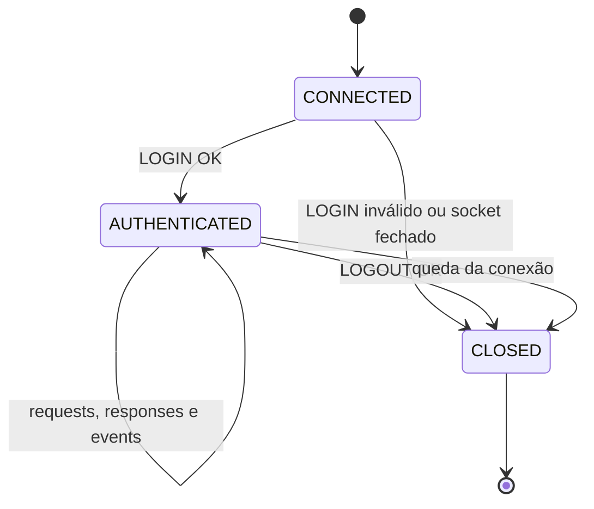

Enquanto a conexão estiver em `CONNECTED`, somente `LOGIN` e fechamento do socket são aceitos. Qualquer outra ação deve retornar `AUTH_REQUIRED`.

## Ações do cliente

### LOGIN

Autentica a conexão e cria a sessão do usuário.

Payload:

| Campo | Tipo | Obrigatório | Descrição |
| --- | --- | --- | --- |
| `username` | `String` | Sim | Nome único usado para endereçar o usuário. |
| `displayName` | `String` | Sim | Nome exibido aos demais usuários. |

Resposta `OK`:

| Campo | Tipo | Descrição |
| --- | --- | --- |
| `memberId` | `UUID` | Identificador interno do usuário. |
| `username` | `String` | Username confirmado. |
| `displayName` | `String` | Nome exibido confirmado. |

Erros possíveis: `INVALID_PAYLOAD`, `USERNAME_ALREADY_ONLINE`.

Eventos gerados: `USER_ONLINE` para todos os usuários online, exceto o próprio usuário recém-logado.

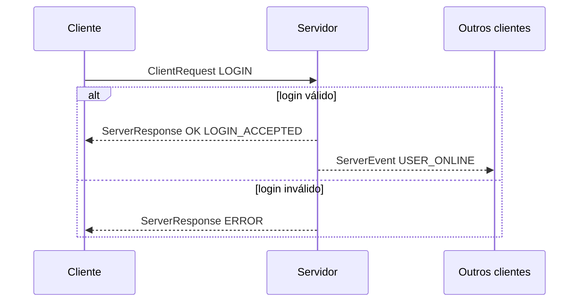

### LOGOUT

Encerra a sessão de forma limpa. Substitui o comando textual `/sair` no fio.

Payload: vazio.

Resposta `OK`: payload vazio.

Erros possíveis: `AUTH_REQUIRED`.

Eventos gerados: `USER_OFFLINE` para todos os usuários online restantes.

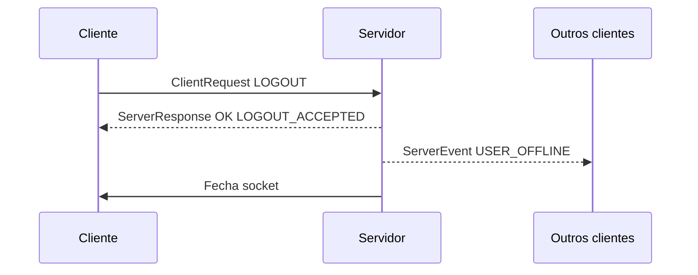

### HEARTBEAT

Confirma que cliente e servidor continuam responsivos.

Payload: vazio.

Resposta `OK`:

| Campo | Tipo | Descrição |
| --- | --- | --- |
| `serverTime` | `Instant` | Horário atual do servidor. |

Erros possíveis: `AUTH_REQUIRED`.

Eventos gerados: nenhum.

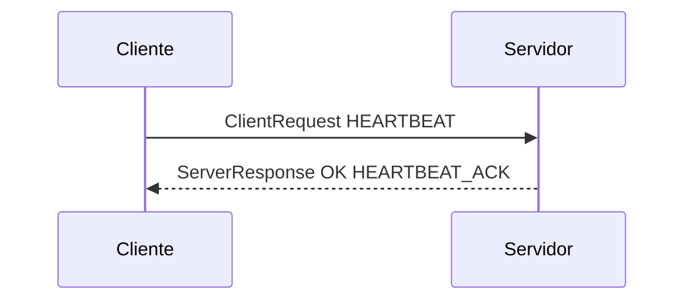

### LIST_USERS

Lista usuários online.

Payload: vazio.

Resposta `OK`:

| Campo | Tipo | Descrição |
| --- | --- | --- |
| `users` | `List<Map>` | Lista com `memberId`, `username`, `displayName` e `online=true`. |

Erros possíveis: `AUTH_REQUIRED`.

Eventos gerados: nenhum.

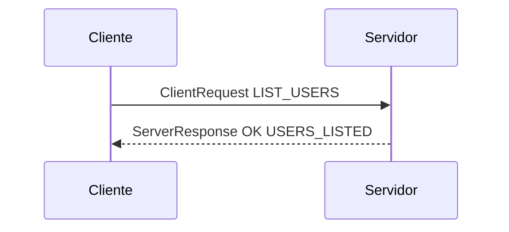

### LIST_GROUPS

Lista grupos existentes em memória.

Payload:

| Campo | Tipo | Obrigatório | Descrição |
| --- | --- | --- | --- |
| `onlyMine` | `Boolean` | Não | Quando `true`, lista apenas grupos dos quais o usuário participa. Padrão: `false`. |

Resposta `OK`:

| Campo | Tipo | Descrição |
| --- | --- | --- |
| `groups` | `List<Map>` | Lista com `groupId`, `groupCode`, `displayName`, `ownerUsername`, `memberCount` e `isMember`. |

Erros possíveis: `AUTH_REQUIRED`.

Eventos gerados: nenhum.

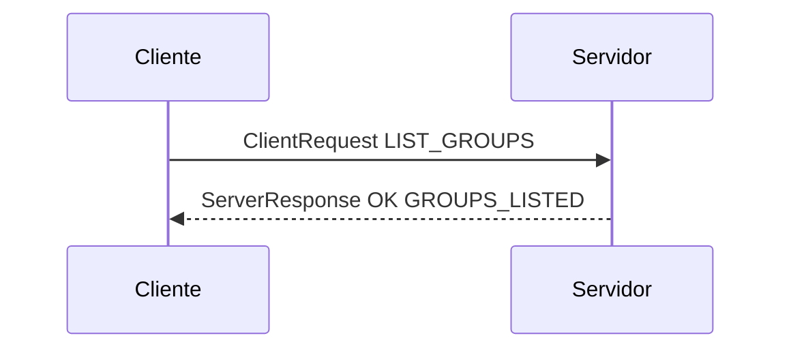

### CREATE_GROUP

Cria um grupo aberto. O criador vira dono e membro inicial.

Payload:

| Campo | Tipo | Obrigatório | Descrição |
| --- | --- | --- | --- |
| `groupCode` | `String` | Sim | Código único usado para entrar e enviar mensagens. |
| `displayName` | `String` | Sim | Nome público do grupo. |

Resposta `OK`:

| Campo | Tipo | Descrição |
| --- | --- | --- |
| `groupId` | `UUID` | Identificador interno do grupo. |
| `groupCode` | `String` | Código confirmado. |
| `displayName` | `String` | Nome confirmado. |
| `ownerUsername` | `String` | Dono do grupo. |

Erros possíveis: `AUTH_REQUIRED`, `INVALID_PAYLOAD`, `GROUP_ALREADY_EXISTS`.

Eventos gerados: `GROUP_CREATED` para todos os usuários online.

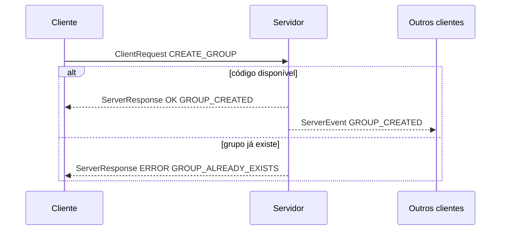

### JOIN_GROUP

Adiciona o usuário autenticado a um grupo aberto.

Payload:

| Campo | Tipo | Obrigatório | Descrição |
| --- | --- | --- | --- |
| `groupCode` | `String` | Sim | Código do grupo. |

Resposta `OK`:

| Campo | Tipo | Descrição |
| --- | --- | --- |
| `groupId` | `UUID` | Identificador interno do grupo. |
| `groupCode` | `String` | Código do grupo. |
| `displayName` | `String` | Nome público do grupo. |

Erros possíveis: `AUTH_REQUIRED`, `GROUP_NOT_FOUND`, `ALREADY_GROUP_MEMBER`.

Eventos gerados: `GROUP_MEMBER_JOINED` para membros online do grupo.

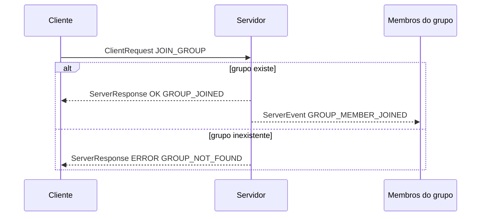

### LEAVE_GROUP

Remove o usuário autenticado de um grupo.

Payload:

| Campo | Tipo | Obrigatório | Descrição |
| --- | --- | --- | --- |
| `groupCode` | `String` | Sim | Código do grupo. |

Resposta `OK`: payload com `groupCode`.

Erros possíveis: `AUTH_REQUIRED`, `GROUP_NOT_FOUND`, `NOT_GROUP_MEMBER`, `OWNER_CANNOT_LEAVE`.

Eventos gerados: `GROUP_MEMBER_LEFT` para membros online restantes.

Regra: o dono não pode sair do grupo enquanto ainda for dono. Ele deve excluir o grupo nesta versão.

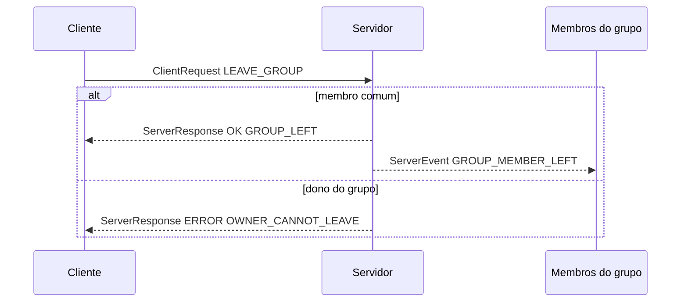

### RENAME_GROUP

Altera o nome público de um grupo. Somente o dono pode executar.

Payload:

| Campo | Tipo | Obrigatório | Descrição |
| --- | --- | --- | --- |
| `groupCode` | `String` | Sim | Código do grupo. |
| `displayName` | `String` | Sim | Novo nome público. |

Resposta `OK`: payload com `groupId`, `groupCode` e `displayName`.

Erros possíveis: `AUTH_REQUIRED`, `GROUP_NOT_FOUND`, `PERMISSION_DENIED`, `INVALID_PAYLOAD`.

Eventos gerados: `GROUP_RENAMED` para todos os usuários online.

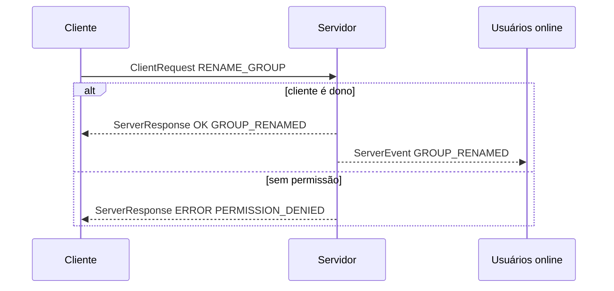

### DELETE_GROUP

Exclui um grupo. Somente o dono pode executar.

Payload:

| Campo | Tipo | Obrigatório | Descrição |
| --- | --- | --- | --- |
| `groupCode` | `String` | Sim | Código do grupo. |

Resposta `OK`: payload com `groupCode`.

Erros possíveis: `AUTH_REQUIRED`, `GROUP_NOT_FOUND`, `PERMISSION_DENIED`.

Eventos gerados: `GROUP_DELETED` para todos os usuários online.

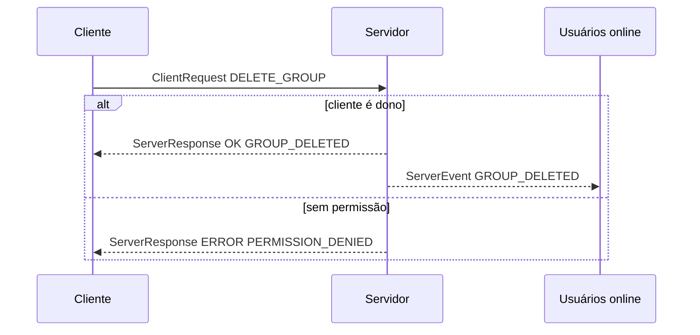

### SEND_DIRECT

Envia mensagem direta 1:1 para outro usuário online.

Payload:

| Campo | Tipo | Obrigatório | Descrição |
| --- | --- | --- | --- |
| `targetUsername` | `String` | Sim | Usuário destinatário. |
| `text` | `String` | Sim | Conteúdo textual da mensagem. |

Resposta `OK`:

| Campo | Tipo | Descrição |
| --- | --- | --- |
| `messageId` | `UUID` | Identificador da mensagem criada pelo servidor. |
| `createdAt` | `Instant` | Momento de registro da mensagem. |
| `deliveredToOnline` | `Boolean` | Sempre `true` quando a resposta for `OK` nesta v1. |

Erros possíveis: `AUTH_REQUIRED`, `INVALID_PAYLOAD`, `USER_NOT_FOUND`, `USER_OFFLINE`, `CANNOT_MESSAGE_SELF`.

Eventos gerados: `DIRECT_MESSAGE` para o destinatário.

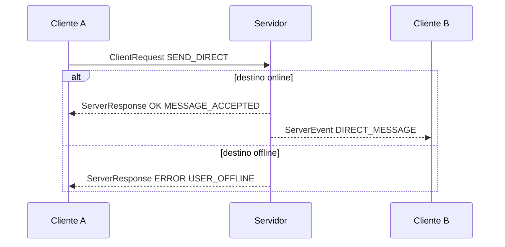

### SEND_GROUP

Envia mensagem para um grupo do qual o usuário participa.

Payload:

| Campo | Tipo | Obrigatório | Descrição |
| --- | --- | --- | --- |
| `groupCode` | `String` | Sim | Código do grupo. |
| `text` | `String` | Sim | Conteúdo textual da mensagem. |

Resposta `OK`:

| Campo | Tipo | Descrição |
| --- | --- | --- |
| `messageId` | `UUID` | Identificador da mensagem criada pelo servidor. |
| `createdAt` | `Instant` | Momento de registro da mensagem. |
| `onlineRecipients` | `Integer` | Quantidade de membros online notificados, sem contar necessariamente o autor. |

Erros possíveis: `AUTH_REQUIRED`, `INVALID_PAYLOAD`, `GROUP_NOT_FOUND`, `NOT_GROUP_MEMBER`.

Eventos gerados: `GROUP_MESSAGE` para membros online do grupo.

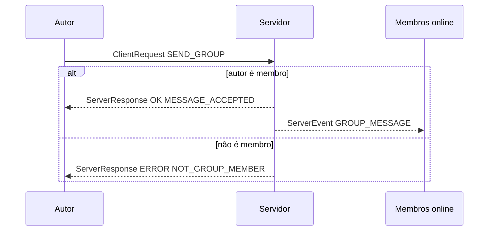

### GET_HISTORY

Consulta histórico em memória.

Payload:

| Campo | Tipo | Obrigatório | Descrição |
| --- | --- | --- | --- |
| `scope` | `String` | Sim | `DIRECT` ou `GROUP`. |
| `target` | `String` | Sim | Para `DIRECT`, o `username`; para `GROUP`, o `groupCode`. |
| `limit` | `Integer` | Não | Quantidade máxima de mensagens. Padrão: `50`. Máximo recomendado: `100`. |

Resposta `OK`:

| Campo | Tipo | Descrição |
| --- | --- | --- |
| `scope` | `String` | Escopo consultado. |
| `target` | `String` | Alvo consultado. |
| `messages` | `List<Map>` | Mensagens em ordem cronológica. |

Erros possíveis: `AUTH_REQUIRED`, `INVALID_PAYLOAD`, `USER_NOT_FOUND`, `GROUP_NOT_FOUND`, `NOT_GROUP_MEMBER`.

Regra: histórico de grupo só pode ser consultado por membro atual.

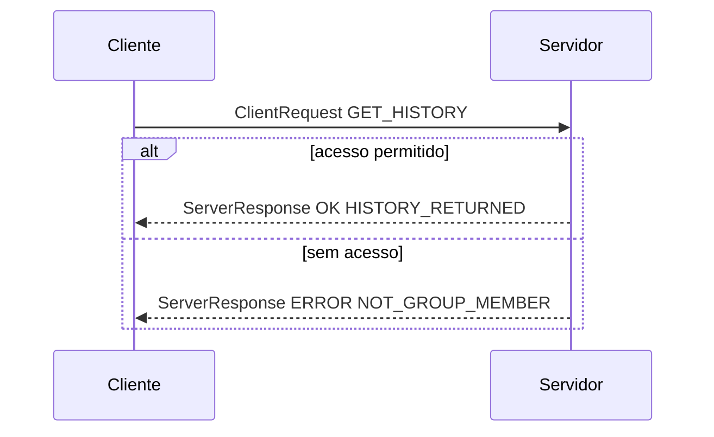

## Eventos do servidor

### USER_ONLINE

Enviado para usuários online quando alguém faz `LOGIN`.

Payload:

| Campo | Tipo | Descrição |
| --- | --- | --- |
| `memberId` | `UUID` | Identificador interno. |
| `username` | `String` | Username do usuário. |
| `displayName` | `String` | Nome exibido. |

### USER_OFFLINE

Enviado para usuários online quando alguém faz `LOGOUT` ou perde conexão.

Payload:

| Campo | Tipo | Descrição |
| --- | --- | --- |
| `memberId` | `UUID` | Identificador interno. |
| `username` | `String` | Username do usuário. |

### DIRECT_MESSAGE

Enviado ao destinatário de uma mensagem direta.

Payload:

| Campo | Tipo | Descrição |
| --- | --- | --- |
| `messageId` | `UUID` | Identificador da mensagem. |
| `fromUsername` | `String` | Remetente. |
| `text` | `String` | Conteúdo. |
| `createdAt` | `Instant` | Momento de registro. |

### GROUP_MESSAGE

Enviado aos membros online de um grupo.

Payload:

| Campo | Tipo | Descrição |
| --- | --- | --- |
| `messageId` | `UUID` | Identificador da mensagem. |
| `groupCode` | `String` | Código do grupo. |
| `groupDisplayName` | `String` | Nome do grupo. |
| `authorUsername` | `String` | Autor. |
| `text` | `String` | Conteúdo. |
| `createdAt` | `Instant` | Momento de registro. |

### GROUP_CREATED

Enviado para todos os usuários online quando um grupo é criado.

Payload: `groupId`, `groupCode`, `displayName`, `ownerUsername`.

### GROUP_RENAMED

Enviado para todos os usuários online quando um grupo é renomeado.

Payload: `groupId`, `groupCode`, `displayName`, `ownerUsername`.

### GROUP_DELETED

Enviado para todos os usuários online quando um grupo é excluído.

Payload: `groupCode`, `deletedByUsername`.

### GROUP_MEMBER_JOINED

Enviado para membros online do grupo quando um usuário entra.

Payload: `groupCode`, `username`, `displayName`.

### GROUP_MEMBER_LEFT

Enviado para membros online restantes quando um usuário sai.

Payload: `groupCode`, `username`, `displayName`.

## Códigos de resposta

### Sucesso

| Código | Uso |
| --- | --- |
| `LOGIN_ACCEPTED` | Login realizado. |
| `LOGOUT_ACCEPTED` | Logout realizado. |
| `HEARTBEAT_ACK` | Heartbeat respondido. |
| `USERS_LISTED` | Usuários listados. |
| `GROUPS_LISTED` | Grupos listados. |
| `GROUP_CREATED` | Grupo criado. |
| `GROUP_JOINED` | Usuário entrou no grupo. |
| `GROUP_LEFT` | Usuário saiu do grupo. |
| `GROUP_RENAMED` | Grupo renomeado. |
| `GROUP_DELETED` | Grupo excluído. |
| `MESSAGE_ACCEPTED` | Mensagem aceita e registrada. |
| `HISTORY_RETURNED` | Histórico retornado. |

### Erro

| Código | Quando usar |
| --- | --- |
| `AUTH_REQUIRED` | Ação enviada antes de `LOGIN`. |
| `INVALID_PAYLOAD` | Payload ausente, inválido ou com campo obrigatório vazio. |
| `UNKNOWN_ACTION` | Ação não reconhecida. |
| `USERNAME_ALREADY_ONLINE` | Username já conectado. |
| `USER_NOT_FOUND` | Usuário nunca registrado na memória do servidor. |
| `USER_OFFLINE` | Usuário existe, mas não está online. |
| `CANNOT_MESSAGE_SELF` | Usuário tentou enviar mensagem direta para si mesmo. |
| `GROUP_ALREADY_EXISTS` | Já existe grupo com o mesmo `groupCode`. |
| `GROUP_NOT_FOUND` | Grupo não existe. |
| `ALREADY_GROUP_MEMBER` | Usuário já é membro do grupo. |
| `NOT_GROUP_MEMBER` | Usuário não pertence ao grupo exigido. |
| `OWNER_CANNOT_LEAVE` | Dono tentou sair sem excluir o grupo. |
| `PERMISSION_DENIED` | Usuário não tem permissão para a ação. |
| `INTERNAL_ERROR` | Falha inesperada no servidor. |

## Regras de roteamento

- `ServerResponse` sempre volta apenas para o cliente que enviou o `ClientRequest`.
- `DIRECT_MESSAGE` vai apenas para o destinatário online.
- `GROUP_MESSAGE` vai para membros online do grupo.
- Eventos de presença (`USER_ONLINE`, `USER_OFFLINE`) vão para todos os usuários online.
- Eventos `GROUP_CREATED`, `GROUP_RENAMED` e `GROUP_DELETED` vão para todos os usuários online.
- Eventos `GROUP_MEMBER_JOINED` e `GROUP_MEMBER_LEFT` vão apenas para membros online do grupo.
- O servidor não garante entrega para usuários offline nesta v1.

## Regras de histórico

- O histórico é mantido apenas em memória.
- Reiniciar o servidor apaga usuários, grupos e mensagens.
- Mensagens diretas só são aceitas se o destinatário estiver online.
- Mensagens de grupo são registradas mesmo que nem todos os membros estejam online.
- Não existe fila offline.
- `GET_HISTORY` retorna no máximo `limit` mensagens.
- Para grupos, somente membros atuais podem consultar o histórico.

## Compatibilidade com comandos de texto

Comandos como `/sair`, `/grupo criar` ou `/msg maria` pertencem à interface do cliente. O cliente pode oferecer esses comandos ao usuário humano, mas deve traduzi-los para envelopes tipados antes de enviar ao servidor.

Exemplos:

| Entrada no cliente | Envelope enviado |
| --- | --- |
| `/sair` | `ClientRequest action=LOGOUT` |
| `/msg maria Oi` | `ClientRequest action=SEND_DIRECT` |
| `/grupo criar devs Desenvolvedores` | `ClientRequest action=CREATE_GROUP` |
| `/grupo entrar devs` | `ClientRequest action=JOIN_GROUP` |

O servidor não deve depender de interpretar barras dentro do texto da mensagem. Assim, uma mensagem comum pode começar com `/` sem ser confundida com comando.

## Fluxo geral de uma sessão

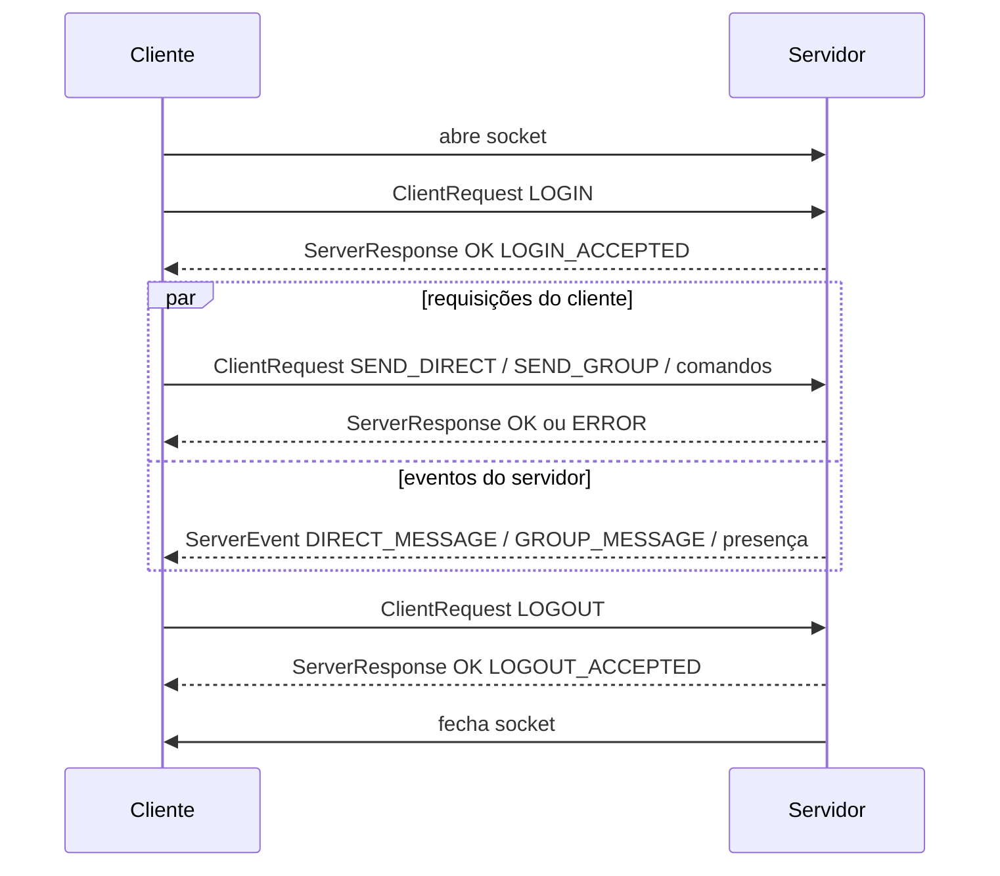

## Critérios de aceitação para implementação futura

- O servidor rejeita qualquer ação diferente de `LOGIN` antes da autenticação.
- Toda requisição recebe exatamente uma `ServerResponse` com o mesmo `requestId`, exceto em queda abrupta de conexão.
- Eventos assíncronos usam `ServerEvent` e não substituem respostas.
- Mensagem direta para usuário offline retorna `USER_OFFLINE`.
- Mensagem de grupo exige que o autor seja membro.
- Criar, renomear e excluir grupo respeitam a regra de dono.
- Histórico de grupo não é retornado para não membros.
- O comando textual `/sair` deixa de ser parte do protocolo de rede e passa a ser apenas açúcar sintático do cliente.
